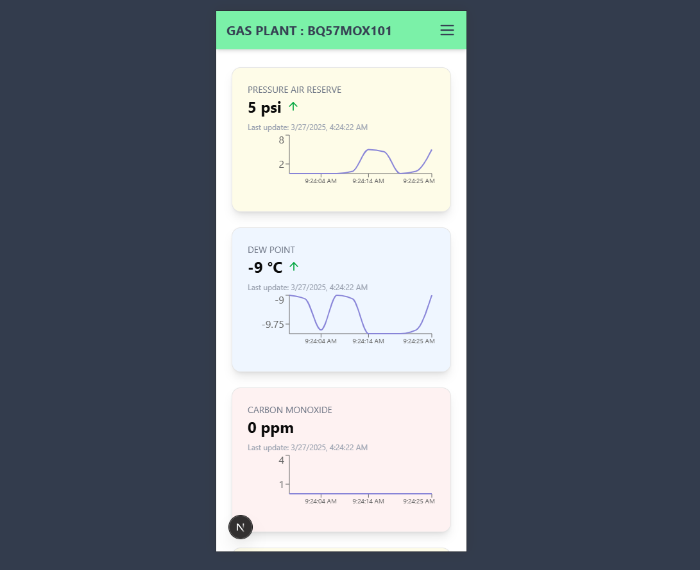

# APP for Gas Plant

This is a simple app for gas plant monitoring and control. It allows users to monitor gas levels, control valves, and receive alerts for any anomalies.

## Features

- Real-time gas level monitoring
- Link: [Gas Plant Monitoring](https://app-gas-plant.vercel.app)

### License

This project is licensed under the MIT License. See the [LICENSE](https://rasysbox.com) file for details.